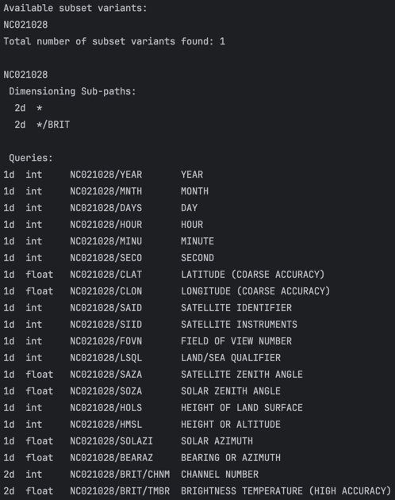
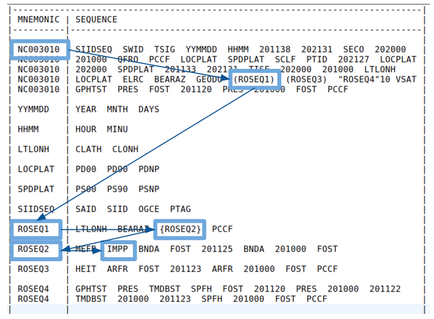

.. _bufr-query-path:

BUFR Query Path
===============

Queries are used to uniquely identify specific elements in a BUFR file (the Targets). This ability to select specific
elements is what gives this component the ability to work.

Query Basics
------------

The query string can be thought of as a unique ID that points to a specific element in the BUFR
data tree. It looks like a directory path. Here is an example:

**NC003010/ROSEQ1/ROSEQ2/FOST[2]**

- **NC003010** - The subset mnemonic (**\*** will get data from all the subsets)
- **ROSEQ1/ROSEQ2** - Repeated sequences make up the path component
- **FOST** - The mnemonic of the element you are trying to get.
- **[2]** - In case the mnemonic happens multiple times you need to specify the index. In this case
  grab the second one.

You can also filter repeated sequences using **\{ ... \}** as follows:

**NC003010/ROSEQ1/ROSEQ2{1}/FOST[2]**  - Only keep the 1st repeat of ROSEQ2 (drop the ROSEQ2 dimension)

**NC003010/ROSEQ1/ROSEQ2{1-5}/FOST[2]** - Only keep the 1st through 5th repeats of ROSEQ2

.. note::
  Filtering a repeated element down to 1 element will drop the dimension associated with that
  repetition. This is especially useful when dealing with **event** sequences.

Multi Queries
~~~~~~~~~~~~~

Many BUFR files contain multiple subsets with fields that have similar types of data but which do not have the same
mnemonics. A good example is BUFR files that have some subsets that contain ***/LON** (low resolution longitude) and
others that contain ***/LONH** (high resolution longitude). For the purpose of ingesting the data we want all
observations to have longitude and latitude regardless of the resolution. The way to do this is to use a multi query. So
in the previous example you could do the following:

**[\*/LONH, \*/LON]**

The expression is evaluated left to right. If the subset contains ***/LONH** then it will be used, otherwise it will use
***/LON**. You can string any number of queries together this way. The **\*** is a wildcard that matches any subset.
Please note that the queries check the existence of the path in a subset, which is different than asking if a field is
empty (thats a different problem).

Query Identification
--------------------

Show Queries
~~~~~~~~~~~~~

The recommended way to identify queries you might want from a BUFR file is to use the **show_queries.x**
utility. It will generate a list of all the possible queries in a BUFR file which you can copy and paste from.
It will only list subsets variants that are actually in the file. Here is an example:

You can basically just list the queries and copy and paste the relevant ones into you need. The subset names can be
substituted with **\*** to make the queries more general. Use **show_queries.x -h** to see the usage information.

NCEPLIB-bufr gettab
~~~~~~~~~~~~~~~~~~~

The other method is to interpret the BUFR tables that are returned by running the **gettab** NCEPLIB-bufr utility
function. Unfortunately, this method requires a bit more knowledge of the BUFR format. Here is an example:

If you look at the table example you should see that the fields in the table make a tree structure. If you look closely
some of these branches are surrounded by special symbols.

* **( ... )** and **{ ... }** encode branches that have 0 or more data items (are "repetitions"). The number is
  not initially known and is encoded in the data itself.
* **< ... >** represents a branch that are repeated 0 or 1 times (not more).
* **" ... "15** represents a branch that always has 15 elements (defined in the table).
* **[ ... ]** is special in that it represents a "stack". It is another type of repeating branch that repeats 0 or more
  times. Some fields in prepBUFR files have processing steps applied to them and the results are stored in these special
  fields (the most recent version is in the first position, the last version is
  in the second position and so on...). It is usual to read only the most recent version of the data. Example the
  queries will look like this: **\*/PRSLEVEL/Q___INFO/Q__EVENT{1}/QQM**.
* There are branches with no special markings. This means they alyways happen exactly 1 time. These are ignored for the
  purposes of writing your query string (they are not part of the query).

Dimensionality of Queries
-------------------------

Every repeated element in the query adds a new dimension to the data. The number of repeats defines the size of the
dimension.

1st Dimension
~~~~~~~~~~~~~

The root of the BUFR data tree (level of */ or <subset>/) corresponds to the first dimension. Each subset in the BUFR
file adds a new “row” so a query like (*/CLON) will result in a 1D array of values for the BUFR file.

2nd+ Dimension
~~~~~~~~~~~~~~

Each additional repeated sequence along the path leading to the data element adds 1 dimension. The number of repeats
defines the size of each dimension. In the case where we are dealing with jagged arrays (size of a particular dimension
varies from subset to subset) then the maximum size is used and Missing values are filled in to make everything work.
Please note that if you filter a repeated sequence down to 1 element then the dimension associated with that repetition
will be dropped.
