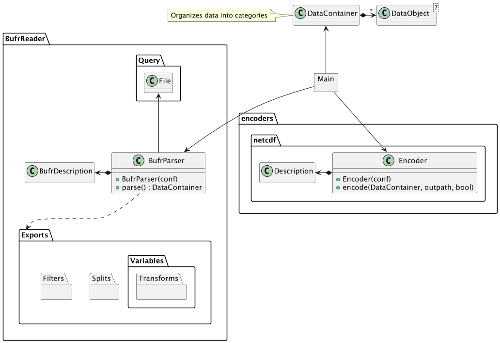
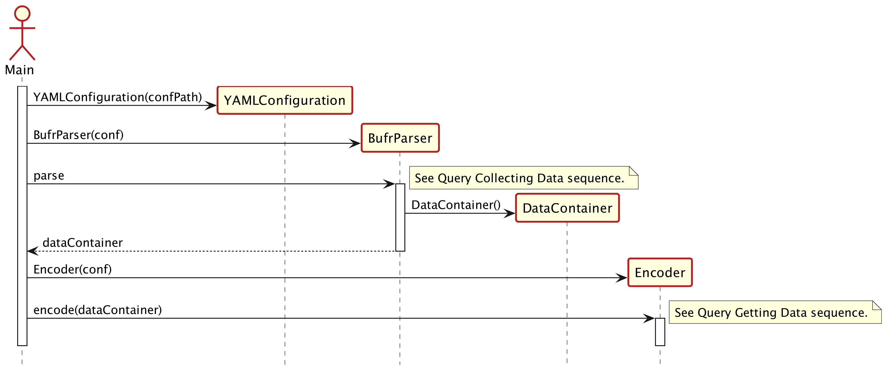
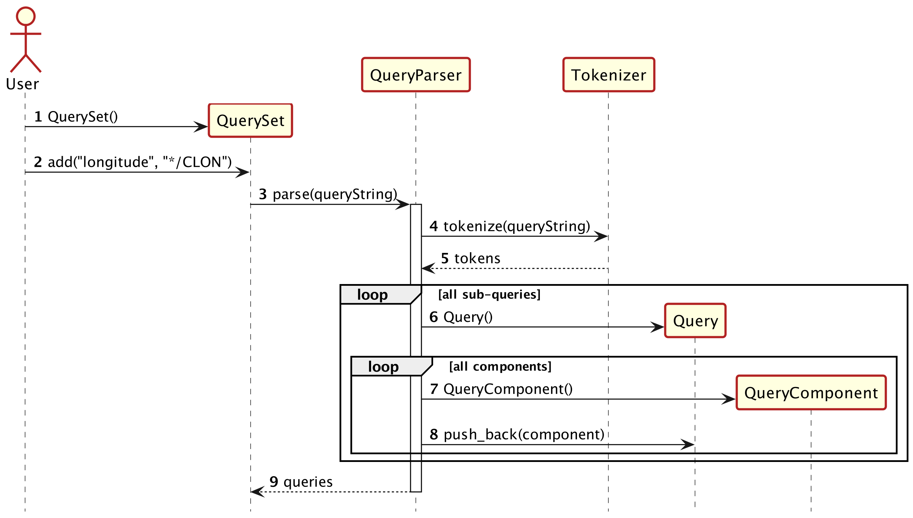
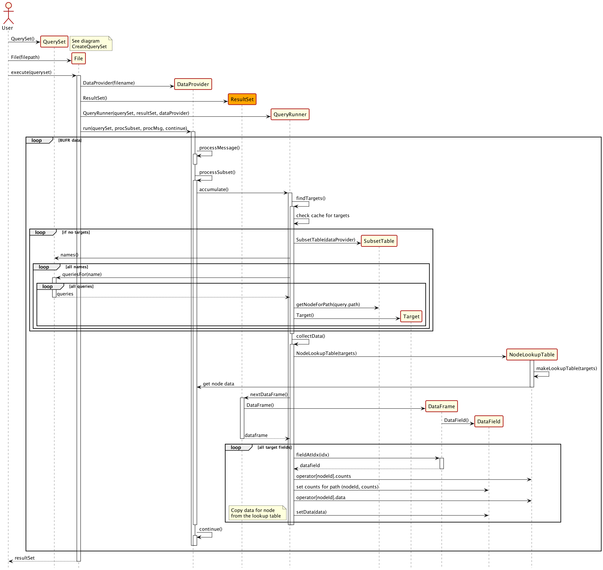
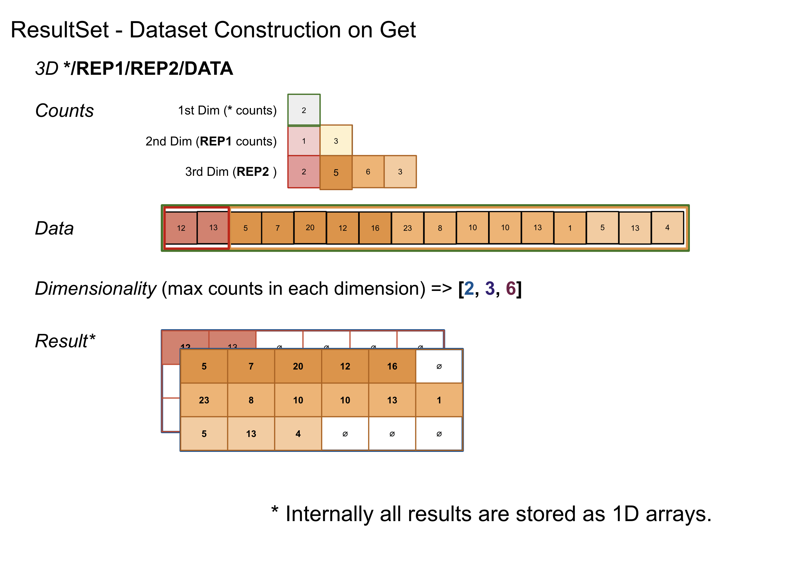
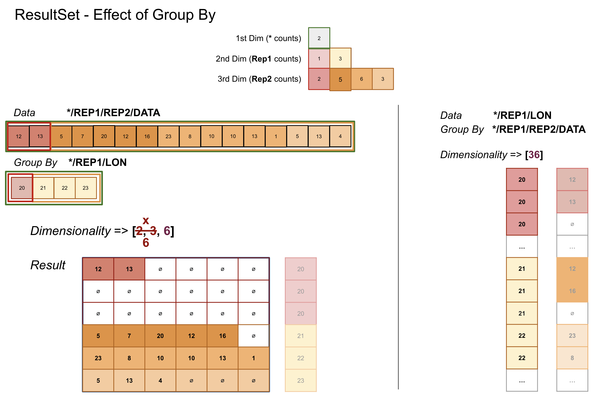
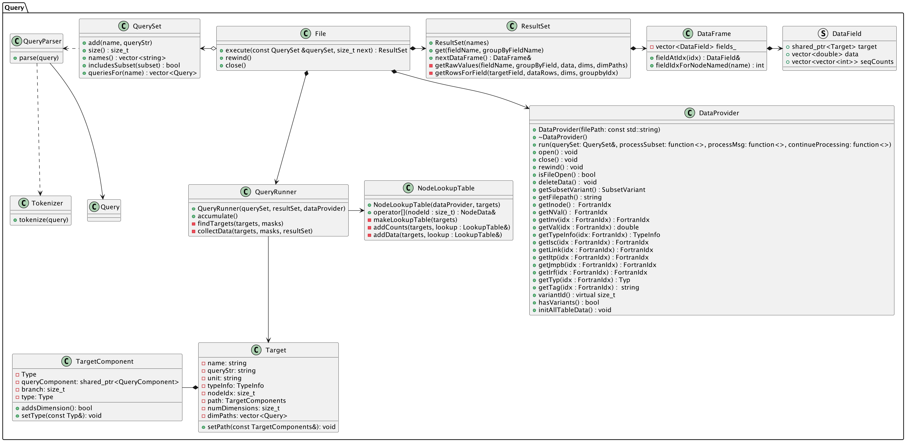

.. _bufr-software-architecture:

Software Design
===============

From the highest level the BUFR IODA backend component is composed of 2 main packages BufrReader and IodaEncoder. The
BufrReader is responsible for taking a BufrDescription (provided in the form of a YAML file) and using it to read
raw BUFR data into a DataContainer object. This DataContainer object is then used by the IodaEncoder (together
with a IodaDescription) to encode an IODA ObsGroup object.

The BufrParser class has some ability to manipulate the data in order to create usable data sets. For example, it
has the ability to split data sets according to the value of a read variable (ex: satellite ID) creating multiple
**Category** of data. It also has a list of **Variables** that can be used to transform groups of data into useful
data fields (ex: turn YEAR, DAY, HOUR, MINU, SECO fields into proper date/time objects [seconds since 1970]).

The basic end-to-end process is illustrated in the following sequence diagram:

BUFR Query Component
--------------------

The high level design picture is fairly straight forward. The heavy lifting of reading data out of the BUFR file is
handled in the Query component. In order to make this component work, a special extension was created in NCEPLIB-bufr
that give access to the underlying data structures in the BUFR file.

The core idea of the Query component is to give access to specific data fields via user provided query strings
:ref:`Query Path`. NCEPLIB-bufr has no such concept so the Query component does all that work (hence the need for
the intrusive access into the NCEPLIB-bufr data structures). The process of taking a user provided query string and
turning it into a Query is shown in the following sequence diagram:

For efficiency reasons, all the queries a user wants to perform are organized into a single QuerySet object that
is used while parsing the contents of a BUFR file. The QuerySet is used to identify the list of Target(s) that need to
be captured from each BUFR subset variant (confusing... let me explain).

Target Identification
~~~~~~~~~~~~~~~~~~~~~

A BUFR file is composed of a list of **messages**. Each message is composed of a list of **subsets**. Each subset is
associated with a meta data table that describes how the data is laid out and the block of data for that subset.
Unfortunately WMO BUFR files have subsets whose tables are sometimes not consistent, so you need to keep track of the
**variant** of the subset (ugg). These subset tables are used to identify the list of **Target** (finds the unique ID
that identifies data associated with a specific elements in the data tree) that need to be captured from each subset.
Please note this is not just the *leaf* elements, but it needs to capture data about the intermediate nodes as well in
order to record the dimensional information of the leaf element. Finding the **Target** info is expensive, so the
results are cached.

Data Collection
~~~~~~~~~~~~~~~

Once the list of **Target** is identified for the specific **subset** **variant** we are currently processing
we can go through the data and collect the targeted data into a DataFrame. The DataFrame is basically just a list of
target data for a specific subset variant (DataFields). These objects accumulate for each subset variant instance in the
BUFR file (could be hundreds of thousands of them). The following sequence diagram demonstrates this process:

Result Set
~~~~~~~~~~

From the diagram from the previous section we see that the DataCollection process creates a ResultSet object. This
object contains the collection of DataFrames that we accumulated in the DataCollection process. Its primary purpose
is to construct usable datasets from the raw collected data (when you call `get`). The data sets can be
multi-dimensional and jagged (not all rows have the same number of elements). Each DataFrame contains the leaf element
values and the repeat counts for each dimension of that leaf element (its basically a table of lists). If you have a
path */REP1/REP2/DATA the counts for REP1 and REP2 are stored in the DataFrame (if REP1 and REP2 are repeated elements
this path represents a 3d data set).

The following is an illustrative example of how the counts arrays are used to construct a 3d data set:

In the illustration the counts for the 1st dimension is the number of message subsets read as part of this dataset. Each
repeating path element adds an additional dimension. The number of counts in each addtional dimension (the size of that
array) is the sum of the counts in the previous array. The size of each dimension is the maximum count in the counts
array for that dimension. The relationship of the counts between each dimensions counts array map the data into the
result (follow the colors).

Sometimes it becomes necessary to group elements according to each other (`get(var, group_by=var2)`). Simple example:
you might have a BUFR dataset that record balloon data from multiple balloon launches. The root dimension (row) of the
data set might record the datetime, and location of the launch. The observation data you really care about (data,
locations, timestamps, etc) are recorded in a repeating sequence inside each row (message subset). You could read the
data into a 2d data set but this isn't ideal (adds unnecessary complexity). Instead what you'd really like to do is
unfold the repeating sequence into a 1d data set. You can do this by grouping the data according to an element in the
repeating sequence (ex: the observation longitude). By doing this you define a pivot point to unfold the data. Elements
that are at a lower dimension to the pivot get repeated for each element in the pivot. Elements that are at the same or
higher dimensions are, in a sense, rotated or transposed according to the pivot. So if you imagine the balloon example
as a spreadsheet each data field would turn into one column. The "launch location" column (if recorded) would end up
being repeated for each relevant observation. Each recorded observation field would just be another 1d column (as
opposed to a 2d object).

The following is an illustrative example of how the group by process works but applied to a higher dimensional object (
any number of dimensions can be handled this way):

Class Diagram
~~~~~~~~~~~~~

Here is a brief overview of the classes involved in the BUFR Query component (there are a lot of details):

